# Blazing Pizza

It's a tutorial Blazor Application for selling pizzas, to learn how to quickly develop Balzor apps.

This tutorial has only one disadvantage, it makes you hungry ;)

This tutorial cames from **Learn Microsoft** :

[Learn Micrsoft - build-web-apps-with-blazor](https://learn.microsoft.com/fr-fr/training/paths/build-web-apps-with-blazor/)

# Tutorial's Steps

* [Now using DataAnnotations](#Now-using-DataAnnotations)
* [Create an EditContext for EditForm binding on](#Create-an-EditContext-for-EditForm-binding-on)
* [Better place for ValidationSummary](#Better-place-for-ValidationSummary)
* [First call to JavaScript](#first-call-to-javaScript)

# Contributing

This project welcomes contributions and suggestions.  Most contributions require you to agree to a
Contributor License Agreement (CLA) declaring that you have the right to, and actually do, grant us
the rights to use your contribution. For details, visit https://cla.opensource.microsoft.com.

When you submit a pull request, a CLA bot will automatically determine whether you need to provide
a CLA and decorate the PR appropriately (e.g., status check, comment). Simply follow the instructions
provided by the bot. You will only need to do this once across all repos using our CLA.

This project has adopted the [Microsoft Open Source Code of Conduct](https://opensource.microsoft.com/codeofconduct/).
For more information see the [Code of Conduct FAQ](https://opensource.microsoft.com/codeofconduct/faq/) or
contact [opencode@microsoft.com](mailto:opencode@microsoft.com) with any additional questions or comments.

# Legal Notices

Microsoft and any contributors grant you a license to the Microsoft documentation and other content
in this repository under the [Creative Commons Attribution 4.0 International Public License](https://creativecommons.org/licenses/by/4.0/legalcode),
see the [LICENSE](LICENSE) file, and grant you a license to any code in the repository under the [MIT License](https://opensource.org/licenses/MIT), see the
[LICENSE-CODE](LICENSE-CODE) file.

Microsoft, Windows, Microsoft Azure and/or other Microsoft products and services referenced in the documentation
may be either trademarks or registered trademarks of Microsoft in the United States and/or other countries.
The licenses for this project do not grant you rights to use any Microsoft names, logos, or trademarks.
Microsoft's general trademark guidelines can be found at http://go.microsoft.com/fwlink/?LinkID=254653.

Privacy information can be found at https://privacy.microsoft.com/en-us/

Microsoft and any contributors reserve all other rights, whether under their respective copyrights, patents,
or trademarks, whether by implication, estoppel or otherwise.

---

# First Step

Slider is now binding on pizza'a price and size

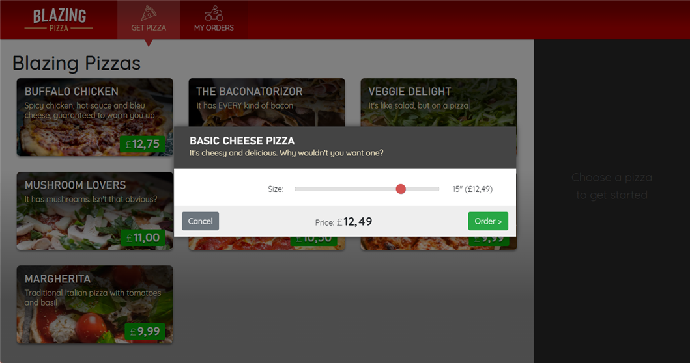

# Second Step

Add Navigation

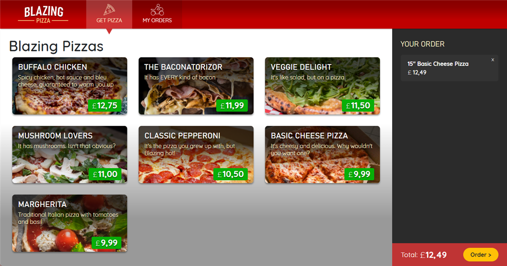

# Acces to Data

Use of **SQLLite** to stock pizzas :

[Learn Microsoft - Acces do data](https://learn.microsoft.com/fr-fr/training/modules/interact-with-data-blazor-web-apps/5-exercise-access-data-from-blazor-components)

# Allow customers to place an order

Manage Checkout Page's PlaceOrder button

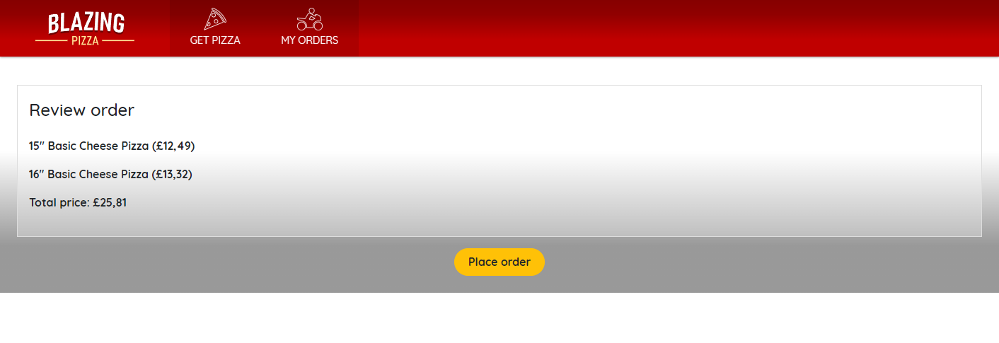

# Add Entity Framework support for orders and pizzas

To test it's needed to remove the tree files pizza.db, pizza.db-shm, pizza.db-wal
to make de DB recreat by **Entity Framework**

# Add an Order Page

It's find for the customer to be able to summarize his orders

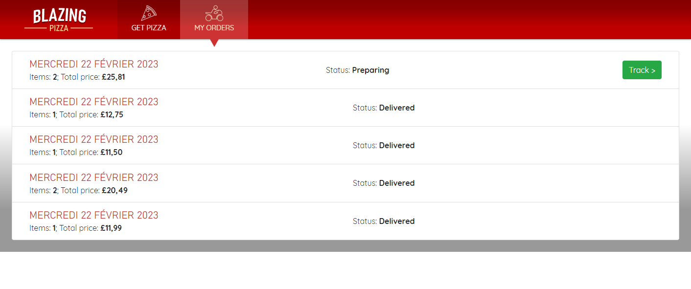

# Oder Detail Page

Now you have a recap for your orders.

Use of **MainLayout** to factorize Navagation buttons

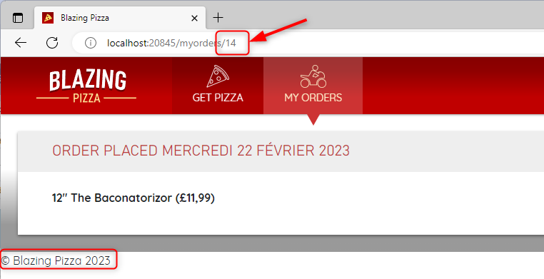

# Add new Validation Page

I had **problems** with the Blazor Component CodeBehind Templates (VS2022) and the directive **@page "/"** should be removed.

Other problem with naming parameters of Shared Pages AddressEditor and OrderReview trying to named parameters in lower case but don't work.
There was a warnig saying that lower case is a mistake to naming convention.
A thought I did it before in particular with Index.rasor.

Is this problem due to not using **@inhirits** from PageBase should be checked.

I'm not sure using IndexBase:ComponentBase and not partial so you can make properties protected is very usefull, the template does'nt.

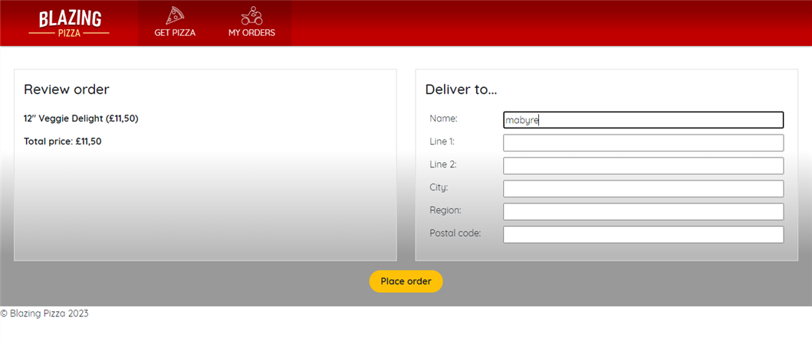

# First play with Validation Message

* Add EditForm in Checkout.razor and **InputText** in AddressEditor.razor to play with form validation.

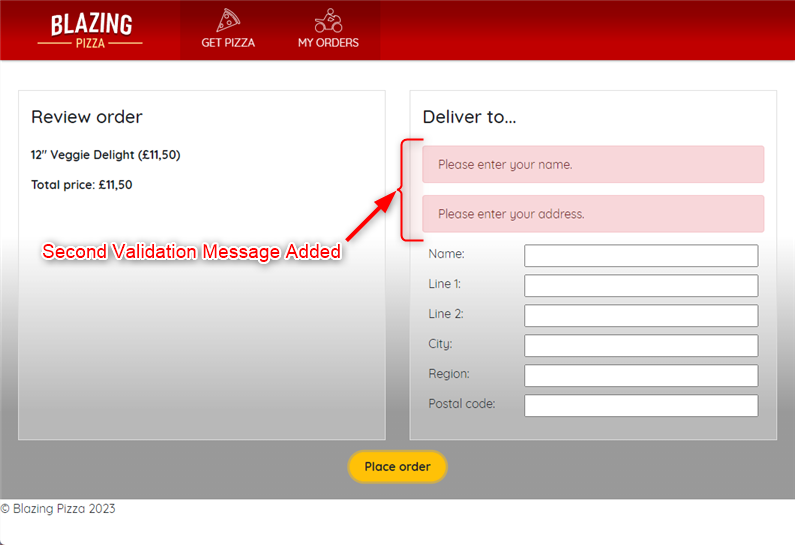

# Now using DataAnnotations

* **DataAnnotations** are very wellknow in validation form process

Here I add a big problem because the form was not good like there was no OnInvalidSubmit and 
the message was like lost connection with server thought was because of codebehind but no
connect a ShowError method to OnInvalidSubmit make it work again

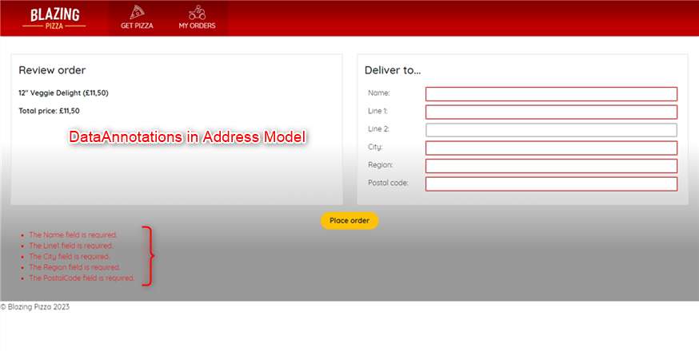

# Better place for ValidationSummary

* Before we remove the ValidationSummary I'd like to show there can ba a better place

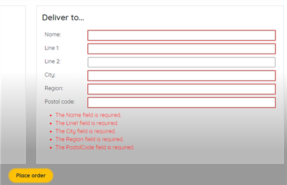

# Create an EditContext for EditForm binding on

This one was not easy for me because I did not see this binding
<EditForm EditContext=editContext

While binding on Model=order.DeliveryAddress **HandleFieldChanged** was not fired.

It's really a result of the validation of forms because we arrive at efficiency while
coding formular forms

# First call to JavaScript

* Use of **JavaScript.InvokeAsync** to display a confirm dialogbox in JavaScript

I'm glad to correct a Bug in Learn Microsoft concernig the call to JavaScript.InvokeAsync

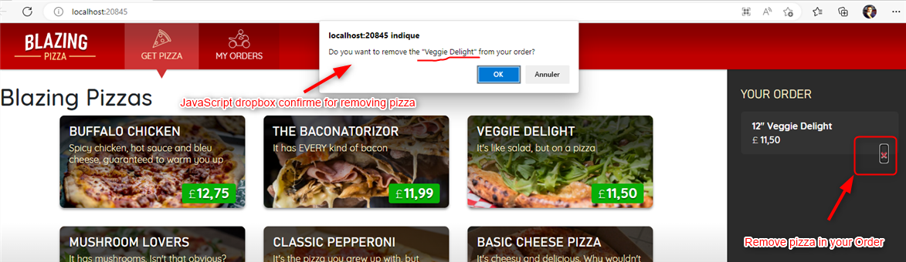

# Adding a third-party JavaScript library to a Blazor app

* Use of sweetalert@latest/dist/sweetalert.min.js 

Display a very cool alert box

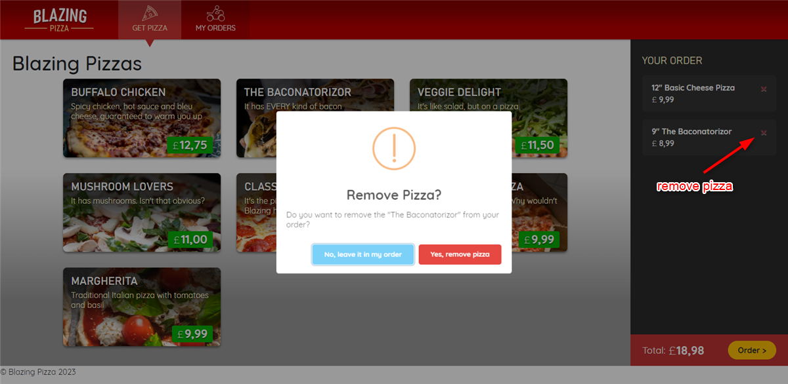

# Create a family's pizza

* For this pizza size is fixed so we don't need slider to choose size in ConfigurePizzaDialog

# Reusing Components Through Modeling

* Creation of a component **@typeparam** TItem to paginate my pizza's orders

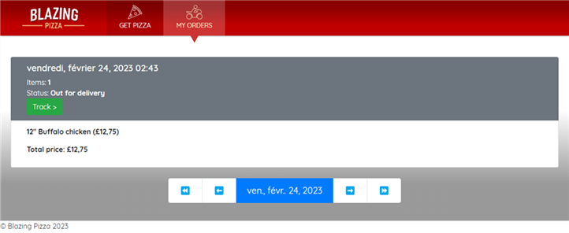

This time tutorial is ending, snif cause I spend good developing in Blazor.

I had just little trobble with version **language C# 9.0 to C# 11.0**, I don't know why obviously I should specify C# 11.0 but I don't. This project now works fine with C# 9.0

I will always continue to build the digital world !

